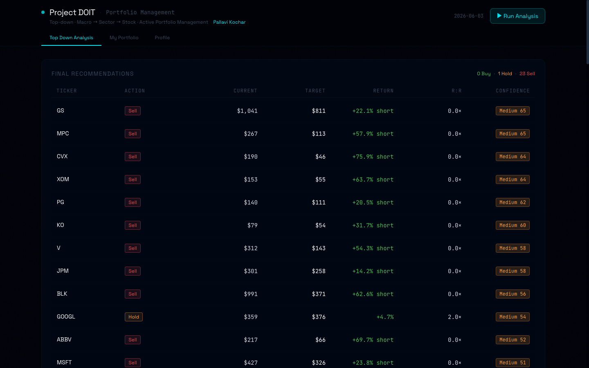
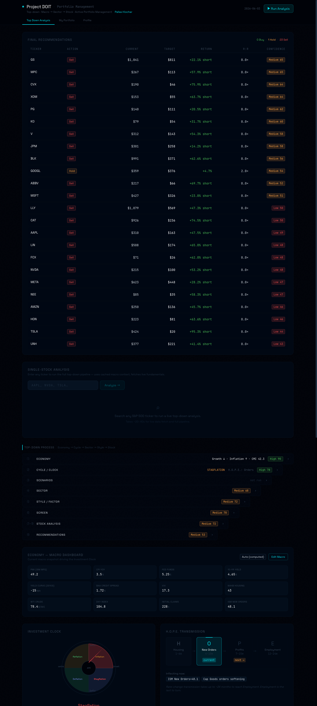

# Project APM — Multi-Agent Top-Down Engine

> *"From the economy down to the stock — macro explains ~70% of a stock's move."*
> — Piper Sandler Field Guide to Macro & Markets / FIN 419/589 Active Portfolio Management, UIUC
>
> **Pallavi Kochar · University of Illinois Urbana-Champaign**

---

## What This Is

Project DOIT is a Python multi-agent system that runs an explicitly **top-down** investment process:

```
Economy → Cycle/H.O.P.E. → Scenarios → Sector → Style/Factor → Screen → Fundamental → Valuation → Risk → Recommendation → Report
                                                                                                                           ↓
                                                                                           Backtest · LLM Analysis · Analyst · SEC Filings
```

Each layer is a separate **agent** that does one job, writes a structured JSON output, and hands off to the next. A React frontend renders the entire funnel visually with three navigation tabs: **Top Down Analysis**, **My Portfolio**, and **Profile**.

A **RAG layer** (Qdrant + LangChain) grounds agents in SEC 10-K/10-Q filings, earnings transcripts, and Fed minutes — so macro, sector, and valuation agents can cite actual management guidance and FOMC language rather than operating purely from quantitative signals.

---

## Screenshots

### Top Down Analysis — Final Recommendations


### Full Pipeline View


> **Add your own:** To capture other views (My Portfolio, Ticker Search, Profile), run the app at `http://localhost:5173` and use your OS screenshot tool. Drop images into `docs/screenshots/` and reference them here.

---

## Quick Start

### Prerequisites
- Python 3.12+ with [`uv`](https://docs.astral.sh/uv/)
- Node.js 20+ with [`pnpm`](https://pnpm.io/)
- Docker (optional — for Qdrant vector DB)

### 1. Install Python dependencies
```bash
uv sync
```

### 2. Run the demo pipeline (no API keys needed)
```bash
python -m apm run --demo
```
Runs all agents on cached data and writes outputs to `output/agents/*.json`.

### 3. Start the API
```bash
uvicorn api.main:app --reload --port 8000
```

### 4. Start the frontend
```bash
cd frontend
pnpm install
pnpm dev
```
Open http://localhost:5173 — the Top-Down Funnel renders immediately on demo data.

### CLI options
```bash
python -m apm run --demo                    # full demo run
python -m apm run --demo --report           # + write output/report.md
python -m apm run --demo --agent economy    # run only EconomyAgent
python -m apm run --demo --from sector      # resume from SectorAgent
python -m apm run --agent backtest          # run live 10-year backtest
python -m apm run --log-level DEBUG         # verbose per-agent logging
```

### Live mode (with API keys)
```bash
export FRED_API_KEY=your_fred_key
python -m apm run                           # live FRED + yfinance data
```

### RAG (optional — SEC filings + Fed minutes)
```bash
# 1. Start Qdrant
docker run -p 6333:6333 qdrant/qdrant

# 2. Bootstrap with sample tickers (AAPL, SPG, O, PLD) + last 3 Fed minutes
python scripts/bootstrap_rag.py

# 3. Or ingest specific filings
python -m rag.ingest --ticker AAPL --doc_type 10-K --year 2023
python -m rag.ingest --file data/raw/fomc_minutes.pdf --doc_type fed_minutes
python -m rag.ingest --all   # ingest everything in data/raw/
```

Once Qdrant has documents:
- The **RAG Research panel** in the dashboard lets you ask free-text questions with per-chunk similarity scores and citations
- **Economy**, **Sector**, and **Valuation** agents automatically include grounded context in their `provenance` output
- The dashboard header shows a live doc count badge (green when docs are ingested)

---

## Frontend Features

### Top Down Analysis tab
- Full top-down funnel view: economy → cycle → scenarios → sector → style → screen → fundamentals → valuations → recommendations
- Investment Clock (Merrill Lynch 4-quadrant) with animated needle + market cycle phase badge
- H.O.P.E. transmission strip (Housing → Orders → Profits → Employment) with rotation direction
- PMI threshold panel: visual expansion/contraction gauge with 50 threshold
- Cost of Money / Cost of Goods lead-lag panel (18m / 24m forward PMI signal — Piper Sandler field guide p.6)
- Style & Factor panel: favored factors with "universal ✓" cross-universe check, avoid list, size/style cyclicality spectrum (SCV → LCG), value vs. growth read, dividend yield warning
- Porter's Five Forces radar (SVG pentagon) in each stock drawer — "Porter / Fundamentals" tab with business model profile, value drivers, risks
- Sector heatmap with macro-variable correlations
- Single-stock ticker search: enter any ticker to run the full pipeline live (uses cached macro context, fetches live fundamentals, ~20–40s)
- 10-year sector rotation backtest with live rerun

### My Portfolio tab
- Add positions: ticker, shares, purchase price, purchase date
- Fetches live prices every 60 seconds via yfinance
- Summary: total invested, current value, total P&L, total return %
- Per-position breakdown: buy price, current price, value, P&L
- Persisted to localStorage

### Profile tab
- Project methodology summary (agents 01–10 + 15)
- Tech stack reference

---

## Methodology: Top-Down Process

### Governing philosophy
- **Macro dominates.** Piper Sandler: ~70% of a stock's movement is explained by macro (market/sector/industry). Brinson et al.: >90% of long-run return variance comes from asset allocation. Macro/cycle/sector/style layers carry the heaviest weight in the confidence score.
- **"Trends → business cycle → sector → factor as a screen."** The economic view decides *where to look*; it does NOT forecast individual stock prices.
- **"The qualitative analysis informs the quantitative analysis, not the other way around."**
- **Scenario analysis is mandatory, not sensitivity analysis.** ≥3 scenarios per stock; every stock must have a realistic downside.
- **Markets move WITH leading indicators** (LEIs). Forecast where LEIs are headed, not where they are.
- **Valuation is a condition, not a catalyst.** Use multiples cross-sectionally vs. current peers; never as a time-series timing signal.

---

## Agent Reference

| # | Agent | Job | Key output |
|---|-------|-----|-----------|
| 1 | `EconomyAgent` | Growth + inflation read; CMI score; LEI forecast | `EconomyData` |
| 2 | `CycleAgent` | Investment Clock phase; H.O.P.E. stage | `CycleData` |
| 3 | `ScenarioAgent` | Scenario set with probabilities (must sum to 1.0) | `ScenariosData` |
| 4 | `SectorAgent` | Sector ranking by macro-variable correlations | `SectorData` |
| 5 | `StyleAgent` | Factor/style selection for the current phase | `StyleData` |
| 6 | `ScreenAgent` | Magic Formula + Greenblatt EBIT/EV ranking | `ScreenData` |
| 7 | `FundamentalAgent` | Porter's Five Forces + narrative + value drivers | `FundamentalData` |
| 8 | `ValuationAgent` | DCF (6-step) + multiples + sector-specific leg per scenario | `ValuationData` |
| 9 | `RiskCorrelationAgent` | Correlation regime; position sizing; crowding | `RiskData` |
| 10 | `RecommendationAgent` | Confidence score; Buy/Hold/Sell ranked recommendations | `RecommendationsData` |
| 11 | `ReportAgent` | Markdown investment report | `output/report.md` |
| 12 | `LLMAnalysisAgent` | Claude-powered synthesis of full funnel | `LLMAnalysisData` |
| 13 | `AnalystAgent` | Analyst consensus + price target aggregation | `AgentOutput` |
| 14 | `SecFilingsAgent` | SEC EDGAR filing summaries | `AgentOutput` |
| 15 | `BacktestAgent` | 10-year sector rotation backtest vs SPY | `BacktestData` |
| 16 | `ResearchAgent` | RAG retrieval from SEC filings + Fed minutes; cited answers | `AgentOutput` |

---

## All Tunable Assumptions

Every numeric assumption in the model is now config-driven — no Python code changes needed to tune the model.

### `config/economic_view.yaml` — Current Macro View

Update monthly with new FRED releases.

| Variable | Current | What it drives |
|----------|---------|---------------|
| `growth.level` | `above_trend` | Investment Clock quadrant |
| `growth.direction` | `falling` | Clockwise rotation signal |
| `inflation.direction` | `rising` | Clock phase (Inflation vs. Stagflation) |
| `leading_indicators.ism_new_orders` | 48.1 | PMI proxy; primary LEI |
| `leading_indicators.nahb_index` | 43 | H.O.P.E. Housing stage |
| `market.ten_year_yield_pct` | 4.65 | Rates → P/E regime |
| `market.baa_credit_spread_pct` | 1.72 | Risk regime |
| `overrides.force_clock_phase` | `null` | Force e.g. `"STAGFLATION"` to override computed phase |

### `config/scenarios.yaml` — Scenario Probabilities & Macro Assumptions

| Scenario | Probability | Rev Growth | Margin | Earnings Growth | Multiple |
|----------|-------------|------------|--------|-----------------|---------|
| Base: Soft Landing | 45% | 6.0% | stable | 8.0% | flat |
| Bull: Reflation | 30% | 8.0% | expanding | 14.0% | expanding |
| Bear: Stagflation | 25% | 2.5% | compressed | −5.0% | compressing |

Probabilities must sum to 1.0 — validated at runtime.

### `config/weights.yaml` — Confidence Score Weights

| Component | Weight | Rationale |
|-----------|--------|-----------|
| Macro/cycle conviction | 30 | Clock phase fit + CMI clarity |
| Sector fit | 20 | Asset allocation dominates long-run returns |
| Style/factor fit | 15 | Factor exposure for the phase |
| Reward-to-risk | 15 | Scenario-weighted upside/downside |
| Fundamental quality | 8 | Porter + narrative + ROIC |
| Cross-sectional valuation | 5 | Cheap vs. current peers only |
| Technical catalyst | 4 | 20/200-day MA |
| Stock-picking regime | 3 | Low correlation = higher conviction |

Penalties: No downside scenario −15 · Crowding −10 · Terminal g warning −8 · Theme not universal −5

Action thresholds: Buy ≥ 60 conf + ≥ 3% return + ≥ 1.5× R:R · Sell < 38 conf or return < −5%

### `config/valuation_assumptions.yaml` — DCF & Sector Model Constants

All previously hardcoded Python constants are now in this file.

**DCF structural:**
| Parameter | Default | Effect |
|-----------|---------|--------|
| `dcf.reinvestment_cap_pct` | 60 | Max % of NOPAT consumed by reinvestment |
| `dcf.tv_fallback_multiple` | 15 | Fallback when WACC ≤ terminal_g |

**Sector forward P/E** (most impactful to tune):
| Sector | Default | Note |
|--------|---------|------|
| Technology | 30× | |
| Financials | 14× | Raise to 18–20× for premier IB universe (GS, MS) |
| Energy | 13× | Compress in oversupply; raise in supercycle |
| Consumer Staples | 20× | |
| *others* | *see file* | |

**Life-cycle P/E multipliers:** Startup 1.30× · Growth 1.20× · Mature 1.00× · Decline 0.85×

**Rate P/E sensitivity:** `rate_pe_sensitivity: 15.0` — P/E compresses 15pts per 100bps above 4% risk-free.

**Third valuation leg:**
- Financials: Gordon Growth P/B — `peer_pb_median_financials: 1.5` (raise to 2.0–2.5 for premier IB peer group)
- Energy/Materials: EV/EBITDA — Energy 9×, Materials 10×
- Tech/Comms (Growth): EV/Sales — Tech 8×, Startup 12×

**Valuation leg weights** (DCF / Multiples / Third):
- Financials: 25% / 20% / 55%
- Energy/Materials: 30% / 25% / 45%
- Others: 45% / 55% / —

**Cross-sectional peer EV/EBITDA medians:** Technology 22× · Health Care 16× · Energy 9× · *see file for all sectors*

### `config/valuation_defaults.json` (written by frontend) — Scalar Defaults

These are editable from the Assumptions panel in the UI without restarting the server.

| Parameter | Default |
|-----------|---------|
| `equity_risk_premium` | 5.5% |
| `tax_rate_pct` | 21.0% |
| `terminal_g_mature` | 2.0% |
| `terminal_g_growth` | 2.5% |
| `bear_multiple_adj` | 0.80× |
| `bull_multiple_adj` | 1.15× |

### `config/sector_macro_corr.yaml` — Sector × Macro Correlations

Source: Piper Sandler Field Guide. Do not change without fresh empirical data.

Key values:
- **Staples**: PMI −0.74, Copper −0.83, BAA +0.75 — most defensive sector
- **Energy**: 10yr +0.77, Oil +0.57 — rates AND oil rising = doubly favored
- **Tech**: 10yr −0.56 — most rate-sensitive large-cap sector
- **Financials**: BAA −0.66 — hardest hit when credit spreads widen
- **Health Care**: Oil −0.73 — outperforms most when oil *falls*

### `config/holdings.yaml` — Current Portfolio

Placeholder positions for the replacement-logic demo. Replace with real positions before a live run.

Replacement rules:
- New Buy replaces the weakest holding in the same group (growth or defensive)
- Only replace if new idea's confidence exceeds holding's by ≥10 points
- Never replace more than one holding per run without override

### `config/universe.yaml` — Ticker Universe

S&P 500 constituents across all 11 GICS sectors. `demo_deep_dive_tickers` controls which tickers get full fundamental + DCF treatment in demo mode (currently 25 tickers including GS, NVDA, AAPL, META, LLY, AMZN, GOOGL, V, UNH, and others).

### CMI Weights — `a01_economy.py`

| Group | Weight | Key inputs |
|-------|--------|-----------|
| Growth | 30% | PMI/ISM New Orders, CB LEI YoY |
| Liquidity | 25% | BAA spread, 10yr yield |
| Inflation | 25% | ISM Prices Paid (inverted) |
| Sentiment | 20% | Michigan Sentiment, VIX (inverted) |

CMI > 50 = expansionary; CMI < 50 = contractionary. Direction matters more than level.

---

## Architecture Notes

- **Shared Context**: A Pydantic v2 `Context` dataclass passes down the chain. Each agent reads upstream outputs from `context.economy`, `context.cycle`, etc.
- **AgentOutput**: Every agent writes a typed `AgentOutput` with `confidence`, `rationale`, `provenance`, and structured `data`. All outputs persist to `output/agents/<name>.json`.
- **Demo mode**: All agents have a demo path using `apm/data/demo_cache/*.json` — no API keys needed.
- **Single-agent runs**: `python -m apm run --demo --agent sector` runs only SectorAgent against cached upstream outputs.
- **Orchestrator**: `--from <name>` resumes the pipeline from any agent, pre-loading cached outputs for all prior agents.
- **Ticker search**: Single-ticker analysis preloads cached macro context (economy → style), injects a synthetic `ScreenCandidate`, then runs Fundamental → Valuation → Risk → Recommendation live. Output saved to `output/ticker/<TICKER>.json`.
- **Config cache**: All YAML files are `lru_cache`-loaded on first access. The API clears the cache automatically when any config is written via the Assumptions panel.
- **RAG layer**: `rag/` is a standalone module. `FinancialRetriever` lazily connects to Qdrant and selects the embedding provider at runtime (OpenAI if `OPENAI_API_KEY` is set, otherwise local `BAAI/bge-base-en-v1.5` via sentence-transformers). Three agents call `_rag_context()` for optional enrichment — it never raises, so the pipeline runs normally with or without Qdrant running.
- **RAG synthesis**: Uses Anthropic Claude (already a project dependency) rather than adding another API key requirement. Model is configurable via `RAG_SYNTHESIS_MODEL` env var.

---

## Frontend Stack

- **React 19** · TypeScript · Vite 6
- **Tailwind CSS v4** (CSS-first config via `@theme {}` in `src/styles.css` — no `tailwind.config.js`)
- **TanStack Query v5** for data fetching and polling
- **Motion v12** · Recharts 2 · D3 v7
- Design palette: warm onyx/charcoal `navy-*` (hue 58) · gold `cyan-accent` · orange `amber-accent` · `green-signal` · `red-signal`
- Background: near-black with subtle gold radial gradient + fine dot-grid overlay
- Fonts: Space Grotesk (display) + JetBrains Mono (data numerals)
- Vite dev server proxies `/api/*` → FastAPI at `:8000`

---

## Running Tests

```bash
uv run pytest tests/ -v
```

Tests cover: scenario probability sum, base-case validation, no-downside warning, terminal-g warning, sector ranking respects cyclicality, high-correlation regime guidance, full pipeline on demo data, API smoke tests.

RAG tests (`tests/test_rag.py`): chunk size validation, document metadata citations, score labels, metadata filtering by ticker and doc_type, empty-collection error handling, synthesis result contract, graceful degradation when Qdrant is unavailable.

---

## Audit Notes

A two-pass code audit (`AUDIT_REPORT.md`) was conducted 2026-07-23 / 2026-07-24.
The following fixes have been applied as of 2026-07-24:

**Fixed:**
- **P1-3 (→ P0): Synthetic price targets** — `a08_valuation.py` now skips any ticker
  with no `market_cap` or `revenue_ttm` in the fundamentals cache. Eliminates fake targets
  from the 16 tickers outside the demo universe.
- **P1-1 (→ P0): DCF formula −30.3% error** — `a08_valuation.py` now computes the proper
  5-year discounted FCFF stream (growing at `rev_growth`) and uses year-5 FCFF as the
  terminal value base (not year-0).
- **P0-2: PMI defaults at discontinuity** — `a01_economy.py` now raises `RuntimeError`
  instead of defaulting to 50.0 when `ism_new_orders` is missing. The 50.0 default sat
  exactly on the expansion/contraction boundary that drives 70 of 100 conviction points.
  Operating margin missing in a08 now logs a warning instead of silently using 12%.
- **P0-3: conviction_score renaming** — `confidence_numeric`/`confidence_label`/
  `confidence_breakdown` renamed to `conviction_score`/`conviction_label`/
  `conviction_breakdown` across Python and TypeScript. The term "confidence" implied
  calibration; "conviction" does not. When `screen_candidate` is absent (19 pts missing),
  those components zero and the total renormalizes against the 81-pt computable base.
- **P0-1: RAG escalation model ID** — `rag/config.py` corrected to `claude-sonnet-5-20251022`.

**Open (not yet fixed):**
1. **Qdrant ingest not idempotent** — `embed_and_upsert()` uses random UUIDs; fix is
   deterministic SHA-based IDs. Post-rebuild collection: 23,380 AAPL chunks confirmed
   (~20× expected due to character-not-token splitting + SGML container source).
2. **PLD 10-K not ingested** — `data/raw/sec-edgar-filings/PLD/` exists but zero PLD chunks in Qdrant.
3. **All 5 backtest metrics are hardcoded constants** (`_DEMO_METRICS`), not recomputed
   at runtime. 13.9% CAGR / +2.1% alpha / 0.94 Sharpe / −27.1% max DD / 59.5% win rate
   must not be cited as APM results.

See `AUDIT_REPORT.md` for the full findings table, code locations, and fix guidance.

---

## Environment Variables

| Variable | Required | Purpose |
|----------|----------|---------|
| `FRED_API_KEY` | No (demo works without it) | Live FRED macro data — get free at fred.stlouisfed.org |
| `ANTHROPIC_API_KEY` | No (LLM features disabled) | Claude for LLM Analysis + RAG synthesis |
| `OPENAI_API_KEY` | No | Better embeddings (`text-embedding-3-small`); falls back to local `BAAI/bge-base-en-v1.5` |
| `QDRANT_HOST` | No (default `localhost`) | Qdrant vector DB host |
| `QDRANT_PORT` | No (default `6333`) | Qdrant vector DB port |
| `RAG_TOP_K` | No (default `6`) | Chunks retrieved per query |
| `RAG_CHUNK_SIZE` | No (default `512`) | Token chunk size for ingestion |

---

## File Tree

```
Project APM/
├── rag/                         # RAG layer (Qdrant + LangChain)
│   ├── __init__.py
│   ├── config.py                # All RAG config (chunk size, top_k, collection name)
│   ├── sources.py               # DocumentMetadata, RetrievedChunk (Pydantic)
│   ├── ingest.py                # Load → chunk → embed → upsert pipeline; SEC EDGAR auto-download
│   └── retriever.py             # FinancialRetriever: embed query → Qdrant → LLM synthesis
├── data/
│   └── raw/                     # Drop PDFs/TXTs here; run python -m rag.ingest --all
├── apm/                         # Python package
│   ├── core/
│   │   ├── agent.py             # Agent ABC, AgentOutput, Context (Pydantic v2)
│   │   ├── orchestrator.py      # Pipeline runner + --from / --agent flags
│   │   └── types.py             # Enums: ClockPhase, HopeStage, Action, etc.
│   ├── agents/
│   │   ├── a01_economy.py       # EconomyAgent — CMI, growth/inflation read
│   │   ├── a02_cycle.py         # CycleAgent — Investment Clock + H.O.P.E.
│   │   ├── a03_scenario.py      # ScenarioAgent — Bull/Base/Bear macro
│   │   ├── a04_sector.py        # SectorAgent — macro-variable correlations
│   │   ├── a05_style.py         # StyleAgent — phase factor leaders
│   │   ├── a06_screen.py        # ScreenAgent — Magic Formula ranking
│   │   ├── a07_fundamental.py   # FundamentalAgent — Porter + narrative
│   │   ├── a08_valuation.py     # ValuationAgent — DCF + multiples per scenario
│   │   ├── a09_risk_correlation.py
│   │   ├── a10_recommendation.py
│   │   ├── a11_report.py
│   │   ├── a12_llm_analysis.py  # Claude-powered synthesis
│   │   ├── a13_analyst.py
│   │   ├── a14_sec_filings.py
│   │   ├── a15_backtest.py      # 10-year sector rotation vs SPY
│   │   └── a16_research.py     # ResearchAgent — RAG retrieval helper; _rag_context()
│   ├── data/
│   │   ├── fetchers.py          # yfinance + FRED + demo cache
│   │   └── demo_cache/          # macro.json, prices.json, fundamentals.json
│   └── utils/
│       ├── config.py            # YAML loader (lru_cache); all get_* helpers
│       ├── sector_ratios.py     # Sector quality scoring + third valuation leg
│       └── logging.py
├── api/
│   └── main.py                  # FastAPI: all /api/* endpoints
├── config/                      # All editable config (no Python changes needed)
│   ├── economic_view.yaml       # Monthly macro readings
│   ├── scenarios.yaml           # Bull/Base/Bear probabilities + macro assumptions
│   ├── weights.yaml             # Confidence score component weights
│   ├── valuation_assumptions.yaml  # Sector P/E, WACC premia, leg weights, peer medians
│   ├── holdings.yaml            # Current portfolio positions
│   ├── universe.yaml            # S&P 500 ticker universe
│   ├── sector_cyclicality.yaml
│   ├── sector_macro_corr.yaml
│   ├── phase_factor_leaders.yaml
│   ├── factor_macro_corr.yaml
│   ├── hope_sequence.yaml
│   └── size_style_cyclicality.yaml
├── frontend/                    # React + Vite + Tailwind v4
│   └── src/
│       ├── components/
│       │   ├── TopDownFunnel.tsx
│       │   ├── InvestmentClock.tsx
│       │   ├── HopeStrip.tsx
│       │   ├── SectorHeatmap.tsx
│       │   ├── BacktestPanel.tsx
│       │   ├── TickerSearch.tsx  # Single-ticker live analysis
│       │   ├── Portfolio.tsx     # My Portfolio with live prices
│       │   ├── ProfilePage.tsx
│       │   ├── RagPanel.tsx      # RAG query widget + source cards + ingestion badge
│       │   └── ConfidenceBar.tsx
│       ├── lib/
│       │   ├── api.ts            # All fetch calls
│       │   └── types.ts          # TypeScript interfaces
│       └── App.tsx               # Three-tab layout
├── output/
│   ├── agents/                  # Agent output artifacts (*.json)
│   └── ticker/                  # Single-ticker analysis outputs (<TICKER>.json)
├── scripts/
│   ├── bootstrap_rag.py         # Download AAPL/SPG/O/PLD 10-Ks + 3 Fed minutes → ingest
│   └── generate_universe.py
├── tests/
│   ├── test_rag.py              # 17 unit tests: chunks, metadata, retrieval, synthesis
│   ├── test_pipeline.py
│   └── test_valuation.py
├── docker-compose.yml           # Qdrant service (+ optional API service)
└── pyproject.toml               # uv-managed dependencies
```
